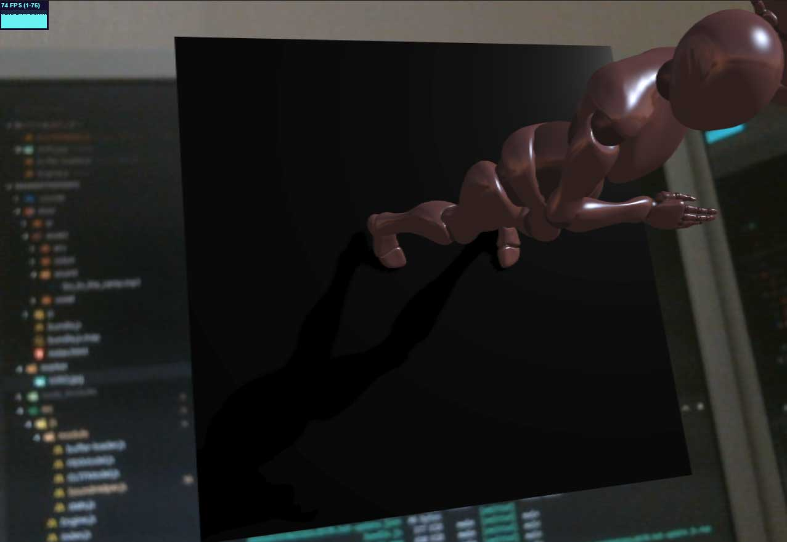

# MarkerTheDance

AR Model Viewer

## Description

WEB 版 AR Model Viewer

Marker([HIRO.jpg](./marker/HIRO.jpg))を認識すると、Marker 上に表示する

website: [https://umizoko.github.io/MarkerTheDance/](https://umizoko.github.io/MarkerTheDance/)

## Requirement

- three.js
- AR.js
- HIRO.jpg
- Web Audio API
